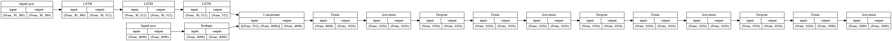
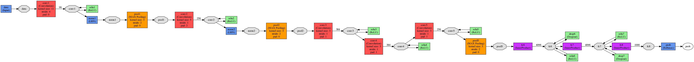
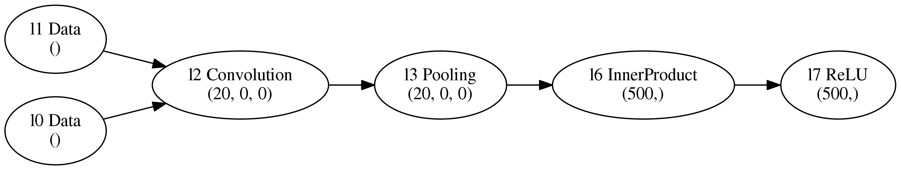

# Research about adding support for exporting model graphs from Fabrik
Attached code requires [common dependencies](../../requirements/common.txt), plus `networkx` and `pydot` Python packages.
## Problem
Currently, there are no tools for drawing Fabrik neural network diagram directly, without the need to do it by hand. This research observes some ways to implement such function.
## Observations
During research, I managed to found some ways. They even can be divided into two groups.
### Based on deep learning frameworks
These methods share the common weakness: they cannot draw unsupported layers. For example, Keras cannot draw LRN layer. Also, they could be implemented in backend only.

Note that all tools can implement with algorithms of conversion Fabrik net to framework model directly, without creating model files.
#### Keras
Keras has its own utilities, described in its [documentation](https://keras.io/visualization/). All methods are based on [Pydot](https://github.com/pydot/pydot) library, a Python interface of [Graphviz](http://graphviz.org/). One of the utilities is used in the `print_keras_model.py`. Below there is VQI model representation drawn by Keras.


To get similar with this or other model type:
```
python print_keras_model.py ../../example/keras/<desired_json_model> <desired_image_name>
```
#### Caffe
Caffe has its own script for visualisation. It actually uses pydot, too. Type `python ~/caffe/caffe/python/draw_net.py --help` to see usage help. Below is vizualised AlexNet.


```
python ~/caffe/caffe/python/draw_net.py ../../example/caffe/<desired_prototxt_model> <desired_image_name>
```
#### Tensorflow
Tensorflow has Tensorboard for graph visualisations. Still cannot see the way how to use it for creating an image, not interactive page.

Also, the Tensorflow method cannot be used for recurrent layers due to the weird representation of them in `.pbtxt`.
### Based on Fabrik's frontend
These ones mostly for frontend representation. Also, they depend only on Fabrik represent
#### Creating an extension
If we decided to create an extension for Fabrik, we could obtain DOM of the graph that already represented and converts it to an image. There is a [JS library](https://github.com/tsayen/dom-to-image) for doing such things. The resulted image will look like a large screenshot of Fabrik net.
#### Implementing using JSON representation
If we dig inside Fabrik a little deeper, we find out that Fabrik stores neural network inside state as JS object. There are obtained sample net representation in `state_net.json`. It's Lenet MNIST with some layers deleted.

The only step to do is to draw a graph based on this data. There are lots of ways, including [NN-SVG](https://github.com/zfrenchee/NN-SVG). Also a lot of different [JS libraries](https://stackoverflow.com/questions/7034/graph-visualization-library-in-javascript) and [other tools](https://www.quora.com/What-tools-are-good-for-drawing-neural-network-architecture-diagrams). In order to keep it simple, I created `draw_graph.py` that outputs pictured neural network with layer types and shapes. It uses [networkx](https://networkx.github.io/) for storing graph and pydot for visualization, so it looks like Caffe's and Keras' network diagrams.


## Conclusion
Framework-based are easy to implement but have a lot of disadvantages. Also, these cannot be customized (Caffe looks prettier because of color though). DOM-based also slow, non-customizable and is a workaround, not a real solution. However, JSON representation-based can be fast and output any form that we want, depending on the library we desire.

## References
- [Keras](https://keras.io/)
- [Caffe](http://caffe.berkeleyvision.org/)
- [Tensorflow](https://www.tensorflow.org/) and [Tensorboard](https://www.tensorflow.org/guide/graph_viz)
- [Pydot](https://pypi.org/project/pydot/) and [Graphviz](https://www.graphviz.org/)
- [DOM-to-image](https://github.com/tsayen/dom-to-image)
- [NN-SVG](https://github.com/zfrenchee/NN-SVG)
- [Graph library list 1](https://stackoverflow.com/questions/7034/graph-visualization-library-in-javascript), [Graph library list 2](https://www.quora.com/What-tools-are-good-for-drawing-neural-network-architecture-diagrams)
- [Networkx](https://networkx.github.io/)
